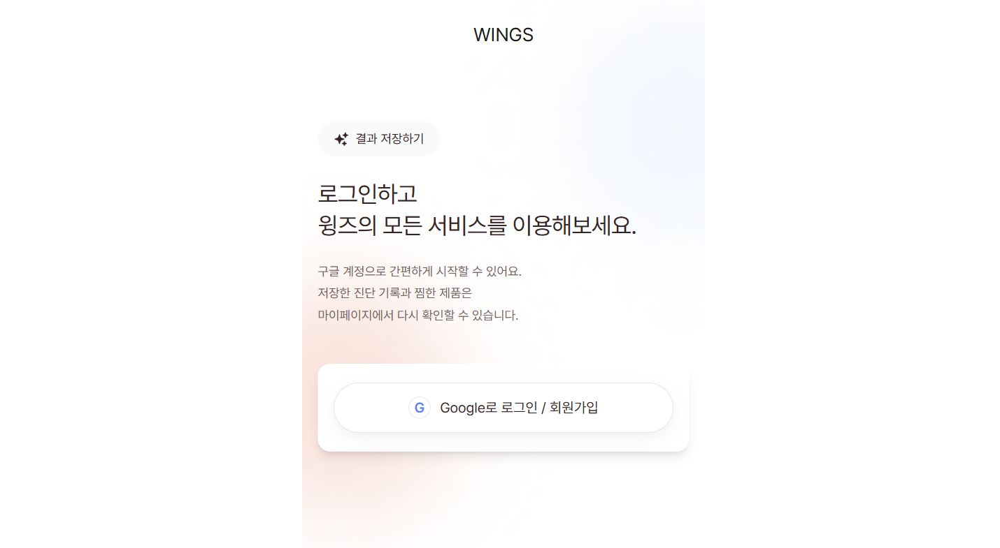

# WINGS Frontend

> 사진 기반 퍼스널컬러 진단과 맞춤 상품 추천, 팝업 부스용 비로그인 진단 흐름을 제공하는 모바일 우선 웹 서비스

[서비스 바로가기](https://frontend-ten-ruddy-46.vercel.app/) · [트러블슈팅](./TROUBLESHOOTING.md)

## 서비스 화면



## 프로젝트 설명

WINGS는 사용자가 얼굴 사진을 업로드해 퍼스널컬러 진단 결과와 추천 상품을 확인하는 서비스입니다. 일반 사용자용 계정·진단 이력 흐름과 함께, 팝업 부스에서 가입 절차 없이 짧은 시간 안에 진단을 마칠 수 있는 게스트 모드를 제공합니다. 별도로 출생 정보를 바탕으로 사주 원국과 참고용 해석을 제공하는 기능도 구현했습니다.

## 핵심 기능

- **퍼스널컬러 진단**: 사진 업로드, 얼굴·밝기 검증, 분석, 보정 설문, 시즌 결과와 상품 추천 흐름을 제공합니다.
- **부스 게스트 모드**: 로그인 없이 사진 선택부터 결과·추천까지 한 브라우저 세션에서 완료할 수 있습니다.
- **회원 기능**: 로그인, 진단 이력, 찜한 상품, 피드백·문의 기능을 제공합니다.
- **운영 기능**: 관리자 화면에서 사용자와 문의를 확인하고 처리할 수 있습니다.
- **사주 분석**: `manseryeok`으로 원국을 계산하고, 서버 함수에서만 해석 모델을 호출합니다.

## 기술 구성

| 영역 | 기술 |
| --- | --- |
| Frontend | React 19, TypeScript, Vite, React Router |
| AI·이미지 | MediaPipe FaceDetector, Gemini |
| 데이터·인증 | Supabase Auth / Database |
| Serverless | Vercel Functions |
| UI·배포 | Tailwind CSS, Vercel |

## 설계 포인트

- 부스 방문자의 이탈을 줄이기 위해 게스트 전용 플로우를 로그인·영구 저장 흐름과 분리했습니다.
- 사진 원본과 출생 정보처럼 민감한 데이터의 보관 범위를 기능별로 명시했습니다.
- Gemini API 키와 Supabase 서비스 키는 브라우저 번들이 아닌 Vercel Functions에서만 사용합니다.
- 구현 전에 `specs/`에 사용자 시나리오와 수용 기준을 기록해 기능 범위와 검증 기준을 맞췄습니다.

## 실행 방법

### 일반 화면 확인

```bash
npm install
npm run dev
```

### Vercel Function을 포함한 확인

```bash
npx vercel dev
```

`.env.example`을 참고해 환경 변수를 설정합니다. `GEMINI_API_KEY`와 `SUPABASE_SERVICE_ROLE_KEY`는 `VITE_` 접두사로 노출하면 안 됩니다.

## 문서

- [부스 게스트 진단 명세](./specs/001-booth-guest-diagnosis.md)
- [사주 분석 명세](./specs/002-sazu-analysis.md)
- [트러블슈팅](./TROUBLESHOOTING.md)
